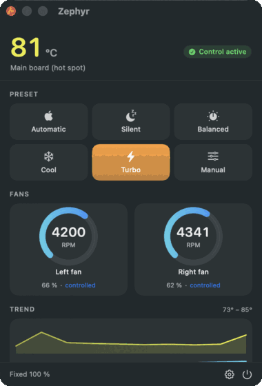
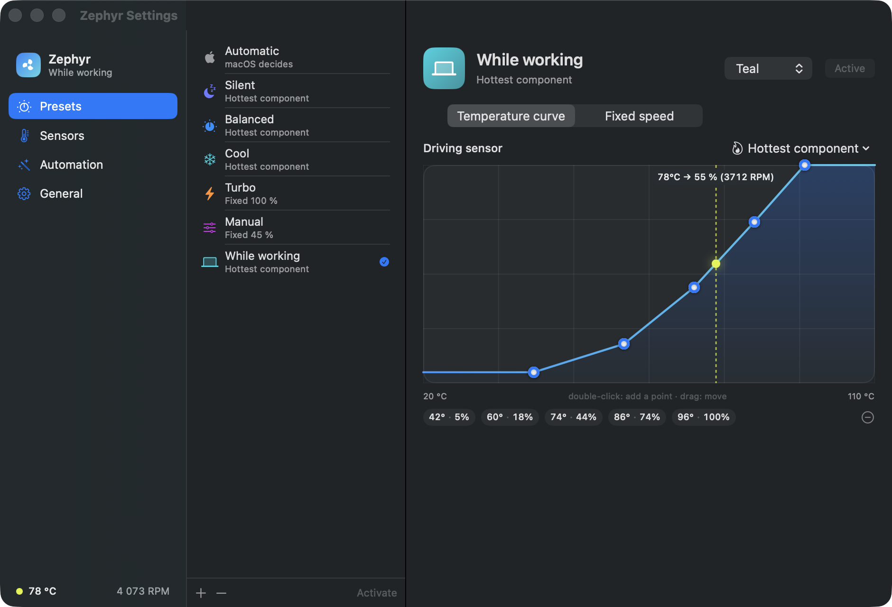
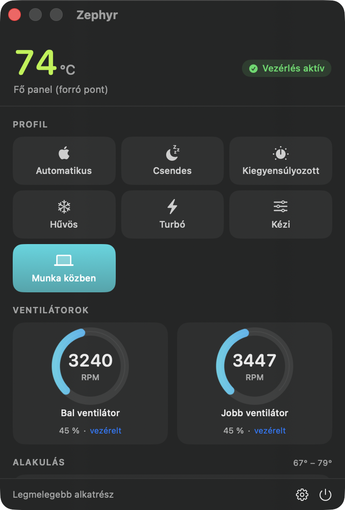

# Zephyr


[](https://github.com/Bajnok11/Zephyr/actions/workflows/build.yml)

**Zephyr** is a native macOS fan control app that lives in your menu bar. It reads every thermal sensor your Mac exposes, and lets you drive the fans from **presets** — including fan curves you draw by dragging points around.

Built and tested on Apple Silicon (M-series). Intel Macs use the same SMC keys and should work, but nothing here has been verified on one — reports welcome.

> **Read this before installing.** Zephyr writes to your Mac's fan controller through a helper that runs as root. It clamps every request to the limits the hardware itself reports and hands the fans back to the firmware the moment anything goes wrong (see [Safety](#safety)) — but holding fans below what macOS would choose means running hotter than Apple intends, and that is your call to make. There is no warranty of any kind; you use it at your own risk.

<p align="center">
  
</p>

<p align="center"><sub>Turbo selected — both fans ramping to their hardware maximum, live.</sub></p>

## Features

- **Menu bar first** — a fan glyph that spins in proportion to actual fan load, with the temperature and/or RPM next to it. Click for the panel, right-click for a quick preset menu.
- **Presets** — *Automatic* (hand control back to macOS), *Silent*, *Balanced*, *Cool*, *Turbo*, and *Manual* with a live slider. Duplicate any of them to build your own.
- **Drag-to-edit fan curves** — set points on a temperature → fan-speed graph and drag them. A live marker shows where your Mac sits on the curve right now, and what RPM that works out to.
- **Pick what drives the curve** — the hottest component, a whole group (CPU, GPU, SoC, memory, SSD…), or one specific SMC sensor out of the couple hundred your Mac reports.
- **Power-source automation** — one preset on battery, another on mains, switched automatically.
- **Emergency cooling** — above a threshold you set, the fans go to 100% no matter which preset is active, and only step back down after 4 °C of hysteresis.
- **Smooth ramping** — a configurable RPM-per-second limit so the fans glide instead of stepping audibly.
- **Sensor browser** — every readable thermal key with its friendly name, grouped and searchable.
- **Launch at login**, light/dark aware, and it stays out of the Dock.

<p align="center">
  
</p>

<p align="center">
  
</p>

## Safety

Forcing fans is a privileged operation, and a fan control app that dies while holding the fans at 20% is a genuinely bad thing to own. Zephyr has three independent nets:

1. **Connection close** — the helper hands the fans straight back to the firmware the moment the app's socket closes, whether it quit cleanly or crashed.
2. **Watchdog** — if the app is alive but stops talking for 12 seconds, the helper releases the fans anyway.
3. **Clamping** — the helper refuses any RPM outside the range the SMC itself reports for that fan (`F<n>Mn`…`F<n>Mx`), so no preset can ask for something the hardware doesn't accept.

Zephyr never lowers fans below the firmware minimum, and "Automatic" is a genuine release — not Zephyr imitating Apple's curve.

## Requirements

- macOS 14 or newer
- A Mac with fans (a fanless MacBook Air will run Zephyr fine as a sensor monitor, but there is nothing to control)
- Xcode command line tools, to build

## Install

### Homebrew

```bash
brew tap Bajnok11/zephyr && brew trust --cask Bajnok11/zephyr/zephyr
```

```bash
brew install --cask zephyr
```

The `brew trust` step is Homebrew's own gate on third-party taps, and the cask clears the download quarantine for you.

### Download a build

Grab `Zephyr-1.0-arm64.zip` from the [latest release](https://github.com/Bajnok11/Zephyr/releases/latest), unzip it, and drag `Zephyr.app` into `~/Applications`.

The app is signed ad-hoc rather than with a paid Apple Developer certificate, so Gatekeeper will not open it on the first try. Clear the download quarantine once:

```bash
xattr -dr com.apple.quarantine ~/Applications/Zephyr.app
```

Then open it normally. (Right-click → **Open** works too, but the command is less fiddly.) If you would rather not trust a binary from a stranger on the internet — a reasonable instinct for something that runs a root daemon — build it yourself instead; it takes about a minute.

### Build from source

```bash
git clone https://github.com/Bajnok11/Zephyr.git
```

```bash
cd Zephyr && ./Scripts/build.sh
```

That compiles everything, assembles `Zephyr.app`, signs it ad-hoc, and installs it to `~/Applications`. Then launch it and, in **Settings → General**, press **Install** to install the privileged helper. macOS asks for your admin password in its own dialog — Zephyr never sees or handles the password itself.

### What the helper installation does

| Path | Purpose |
|---|---|
| `/Library/Application Support/Zephyr/zephyr-helper` | The root helper binary — the only component that writes to the SMC |
| `/Library/LaunchDaemons/com.bence.zephyr.helper.plist` | Starts it at boot and keeps it alive |
| `/var/run/zephyr-helper.sock` | Unix socket, `0600`, owned by the installing user |
| `/var/log/zephyr-helper.log` | Helper log |

To remove all of it, press **Remove** in the same settings pane, or run `sudo ./Scripts/uninstall-helper.sh`. If you installed through Homebrew, `brew zap --cask zephyr` takes out the app and the helper together — plain `brew uninstall` deliberately leaves the helper alone, because Homebrew runs the same step on every upgrade.

## How it works

Zephyr talks to Apple's SMC (`AppleSMC` IOKit service) through the classic 80-byte parameter struct on selector 2. Reading sensors needs no privileges and happens in the app itself. Writing the fan keys does, so that half lives in a small root daemon that speaks a plain-text protocol over a unix socket:

```
HELLO            → OK zephyr-helper 1 fans=2
SET 0 3200       → OK 3200
AUTO 0           → OK
AUTOALL          → OK
```

The helper accepts nothing else. It only ever writes `F<n>Tg` (target RPM) and `F<n>Md` (manual/auto mode), and it verifies the connecting process's uid before accepting a single command.

See [ARCHITECTURE.md](ARCHITECTURE.md) for the full breakdown.

## Sensors

On Apple Silicon the SMC exposes a few hundred thermal keys with no metadata attached. Zephyr recognises the naming scheme Apple has used since the M1:

| Prefix | Meaning |
|---|---|
| `Tp0*` | CPU performance cores |
| `Te0*` | CPU efficiency cores |
| `Tg0*` | GPU |
| `Tm0*` | Memory |
| `Td0*`, `Th0*` | SoC die / heatsink |
| `TH*` | SSD controller and NAND |
| `TB*T` | Battery |
| `Ts0P`, `Ts1P` | Enclosure / palm rest |
| `Ta**` | Airflow and ambient |

Anything unrecognised still shows up in the sensor browser under *Other* with its raw key. Readings outside 1–125 °C are treated as unpopulated sensors and hidden.

## Building from source

```bash
swift build -c release
```

The package has three targets: `ZephyrKit` (SMC access, models, presets, helper client), `ZephyrHelper` (the root daemon), and `Zephyr` (the SwiftUI app). `Scripts/build.sh` wraps this and does the bundling; it deliberately builds into `~/Library/Caches` rather than next to the sources, because iCloud-synced folders corrupt code signatures.

## Troubleshooting

**The menu bar icon isn't there.** Three causes, in order of likelihood:

- *The app that launched Zephyr is disabled in the menu bar allow-list.* This one is vicious, because nothing about it points at Zephyr. macOS 26 keeps a per-app list under **System Settings → Menu Bar → "Allow in the Menu Bar"**, and the block propagates from the **launching** process to whatever it launches. If you start Zephyr from a terminal, an IDE, or a coding agent whose own entry is switched off, Zephyr's status item is silently denied a slot — `NSStatusItem.isVisible` still reports `true`, the button still has a valid frame, and there is no error anywhere. The tell is the geometry: a placed item's window is **33 pt** tall and sits inside the menu bar strip; a denied one is **22 pt** tall and is parked off-screen or flush past the right edge, underneath the system clock. Fix: enable the launching app in that list, or just launch Zephyr normally (Finder, Spotlight, or as a login item).
- *A menu bar manager* (Ice, Bartender, Hidden Bar) puts new items in its hidden section — unhide Zephyr there.
- *The menu bar is genuinely full.* On a notched Mac with a dozen menu bar apps there may be no slot left. Switching the display style to *Icon only* halves the width Zephyr needs.

Zephyr detects all three: when the item is not really placed it opens its panel window instead, with a note explaining what happened. And the app is always reachable — **click Zephyr in Finder / Applications / Spotlight while it is running and the panel opens** — plus the status item's right-click menu has an *Open control panel in a window* entry.

**"Could not connect to the service".** The helper isn't running. Check `sudo launchctl print system/com.bence.zephyr.helper` and `/var/log/zephyr-helper.log`, or just press **Reinstall**.

**Fans don't change.** Another fan control app (Macs Fan Control, TG Pro, smcFanControl) is probably fighting Zephyr for the same SMC keys. Quit the other one — whichever writes last wins, and the result is an unpleasant oscillation.

**Fans read 0 RPM briefly.** Right after control is handed back to the firmware, the SMC can report zeros for a second while its own control loop re-initialises. It settles on its own.

## FAQ

**Is this safe?** It writes the same two SMC keys every other Mac fan utility has written for fifteen years, clamped to the hardware's own limits, with the safety nets described above. That said — see the licence. You run it at your own risk.

**Can it make my Mac quieter than Apple allows?** It can hold the fans at the firmware *minimum* for longer than Apple would. It cannot stop them below that minimum, and thermal throttling still belongs to the firmware — Zephyr can't disable it, which is exactly as it should be.

**Does it phone home?** No network code exists in this repository.

## Licence and disclaimers

MIT — see [LICENSE](LICENSE). As the licence spells out, the software is provided **"as is", without warranty of any kind**, and the author is not liable for any damage arising from its use. That includes anything that follows from running your Mac hotter or cooler than its firmware would.

**Not affiliated with Apple.** This is an independent project. It is not endorsed by, sponsored by, or connected to Apple Inc. "Apple", "Mac", "MacBook", "macOS" and "Apple Silicon" are trademarks of Apple Inc. Zephyr contains no Apple source code; it talks to the SMC through the same publicly documented IOKit interface that fan utilities have used for years, reverse-engineered from public sources.

**Not affiliated with any other fan utility.** Macs Fan Control, TG Pro and smcFanControl are named in the troubleshooting section only because they compete for the same SMC keys. No code from any of them is used here.

**Privacy.** Zephyr has no network code, no analytics and no crash reporting. Everything it reads stays on your Mac; its only files are `~/Library/Application Support/Zephyr/settings.json`, the helper under `/Library/Application Support/Zephyr`, and the helper's log at `/var/log/zephyr-helper.log`.
